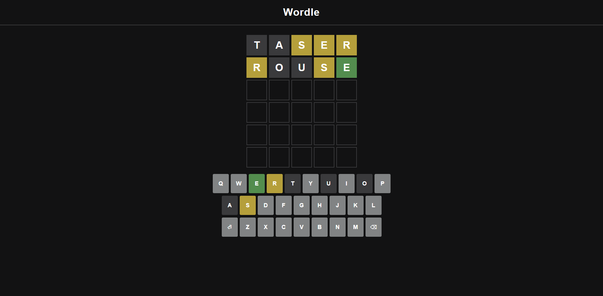

# Wordle Clone

A Wordle clone built with React and Vite. It replicates the core gameplay mechanics of the original Wordle, featuring animated tile feedback, keyboard interaction, custom styling, and word validation via an external dictionary API. It uses JSON Server to provide a local list of solution words.



---

## Features

- 6 tries to guess a 5-letter word
- Colored tiles for correct, misplaced, and incorrect letters
- Keyboard and on-screen keypad input
- Shake animation and message popup for invalid guesses
- Word validation using [dictionaryapi.dev](https://dictionaryapi.dev)
- Random word loaded from `db.json` using JSON Server
- End-of-game modal with a "Play Again" button

---

## Tech Stack

- React (Vite)
- JSON Server
- Custom CSS
- Dictionary API

---

## Project Structure

```
wordle-clone/
├── data/
│   └── db.json
├── public/
│   └── wordle.png
├── src/
│   ├── components/
│   │   ├── Grid.jsx
│   │   ├── Keypad.jsx
│   │   ├── Modal.jsx
│   │   ├── Row.jsx
│   │   └── Wordle.jsx
│   ├── hooks/
│   │   └── useWordle.js
│   ├── App.jsx
│   ├── index.css
│   ├── main.jsx
├── index.html
├── package.json
├── vite.config.js
└── README.md
```

---

## Getting Started

### 1. Clone the repository

```bash
git clone https://github.com/yourusername/wordle-clone.git
cd wordle-clone
```

### 2. Install dependencies

```bash
npm install
```

### 3. Start the JSON Server

```bash
npx json-server --watch data/db.json --port 3001
```

### 4. Start the development server

```bash
npm run dev
```

Then open: [http://localhost:5173](http://localhost:5173)

---

## Future Improvements

- Responsive mobile layout
- Game state persistence via localStorage
- Stats tracking and daily word mode
- Improved accessibility and keyboard focus

---

## License

This project is licensed under the MIT License.